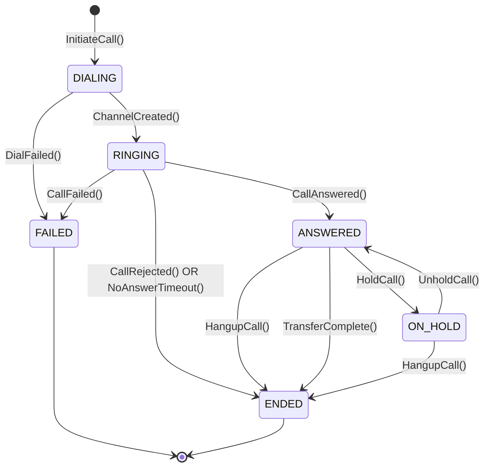
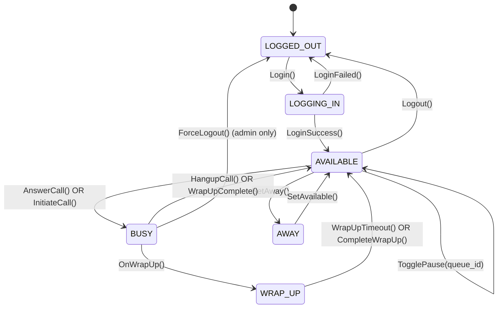
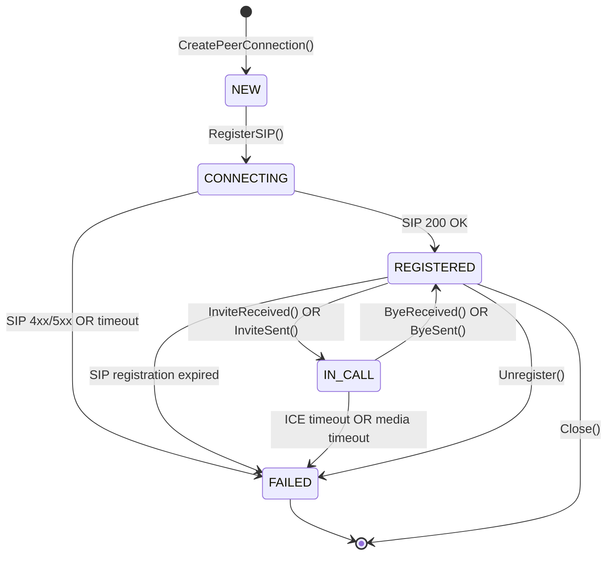
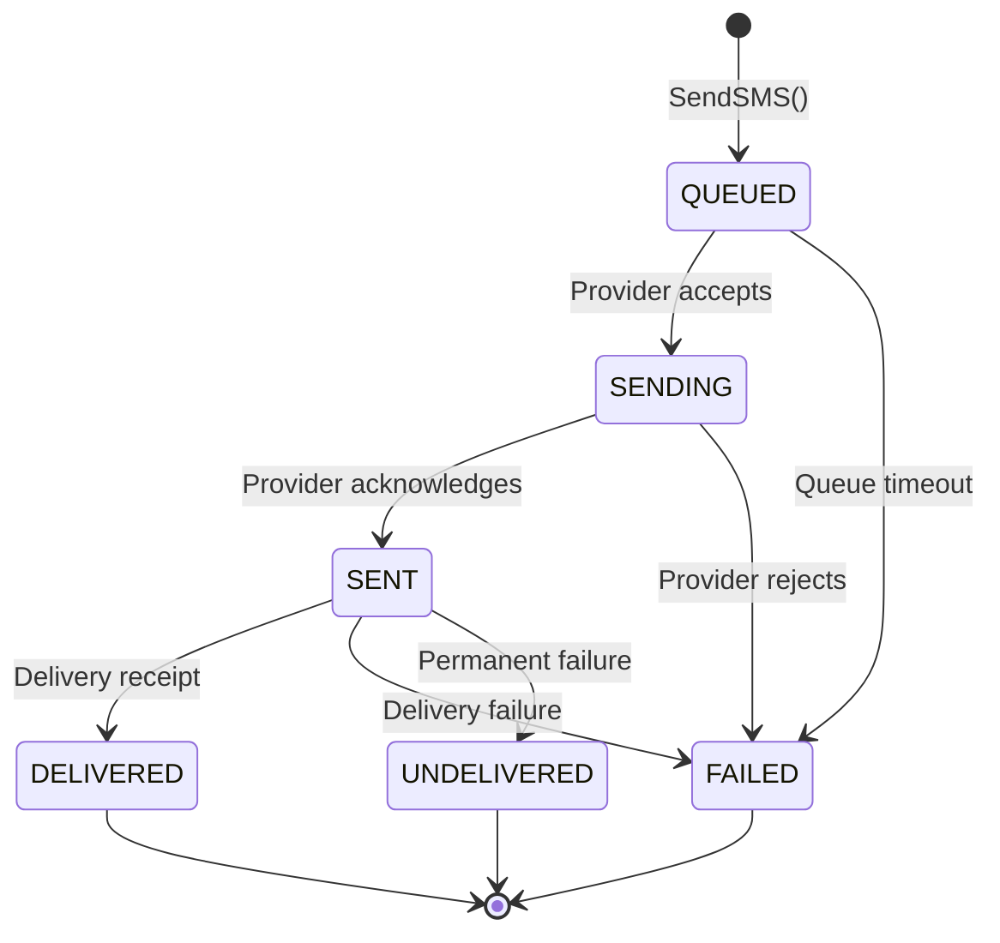
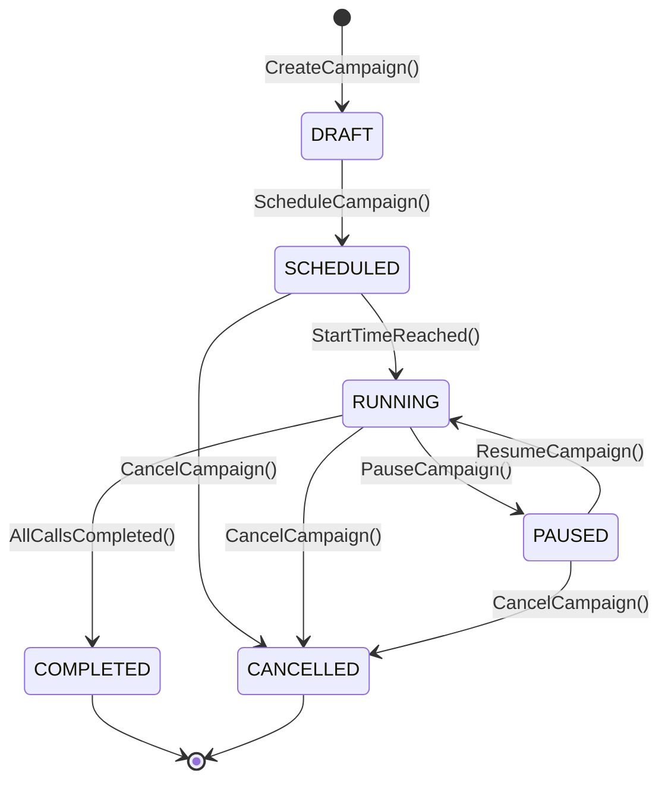

# Canonical State Machine Definitions - Psynq CPaaS Platform

**Version**: 1.0.0  
**Last Updated**: December 31, 2025  
**Status**: SINGLE SOURCE OF TRUTH  
**Purpose**: Complete, unambiguous state machine definitions for all stateful entities  

---

## State Machine 1: Call Lifecycle

### States

### State Definitions

| State | Description | Timeout | Actions |
|-------|-------------|---------|---------|
| DIALING | Call initiated, waiting for channel creation | 30s | Create Asterisk channel |
| RINGING | Remote endpoint ringing | 60s | Play ringback to caller |
| ANSWERED | Call active, media flowing | None | Start recording, billing |
| ON_HOLD | Call active, remote on hold | None | Play MoH, pause recording |
| FAILED | Call failed to complete | None | Log failure reason |
| ENDED | Call terminated | None | Stop recording, finalize CDR |

### Transitions

| From State | To State | Event | Guard Condition | Action | Side Effects |
|------------|----------|-------|-----------------|--------|--------------|
| DIALING | RINGING | ChannelCreated | channel_id != null | Update status='ringing' | Asterisk channel up |
| DIALING | FAILED | DialFailed | error != null | Update status='failed', disposition='failed' | Log error |
| RINGING | ANSWERED | CallAnswered | SIP 200 OK received | Update status='answered', answered_at=NOW() | Start recording, billing |
| RINGING | ENDED | CallRejected | SIP 486/603 received | Update status='ended', disposition='no_answer' | Log rejection |
| RINGING | ENDED | NoAnswerTimeout | ring_timeout exceeded | Update status='ended', disposition='no_answer' | Log timeout |
| RINGING | FAILED | CallFailed | SIP 4xx/5xx error | Update status='failed', disposition='failed' | Log SIP error |
| ANSWERED | ON_HOLD | HoldCall | user_id == agent_id | Update status='on_hold', is_on_hold=true | Play MoH |
| ON_HOLD | ANSWERED | UnholdCall | user_id == agent_id | Update status='answered', is_on_hold=false | Resume media |
| ANSWERED | ENDED | HangupCall | user_id == agent_id OR system | Update status='ended', ended_at=NOW() | Stop recording, calculate duration |
| ON_HOLD | ENDED | HangupCall | user_id == agent_id OR system | Update status='ended', ended_at=NOW() | Stop recording, calculate duration |

### Timeout Values
- **DIALING → FAILED**: 30 seconds (default_dial_timeout)
- **RINGING → ENDED**: 60 seconds (default_ring_timeout)
- **ON_HOLD**: No timeout (manual unhold required)

### Error States
- **FAILED**: Terminal state, entered on any unrecoverable error
- **Entry actions**: Set disposition='failed', hangup_cause=SIP error
- **Recovery**: None (requires new call)

### Business Rules
1. Only the assigned agent or system can transition ANSWERED/ON_HOLD → ENDED
2. Supervisor can barge-in (creates new participant, doesn't change state)
3. Transfer creates new child call with parent_call_id reference
4. Recording only starts when state = ANSWERED (not RINGING or ON_HOLD)
5. Billing starts at answered_at, ends at ended_at (billsec = ended_at - answered_at)

### Validation Criteria
- ✅ All state transitions defined with events
- ✅ All guard conditions specified
- ✅ All side effects documented
- ✅ Timeout values defined
- ✅ Error states covered
- ✅ Business rules explicit

---

## State Machine 2: Agent Status

### States

### State Definitions

| State | Description | Timeout | UI Indicator |
|-------|-------------|---------|--------------|
| LOGGED_OUT | Not authenticated | None | Gray circle |
| LOGGING_IN | Authentication in progress | 10s | Yellow spinner |
| AVAILABLE | Ready to receive calls | None | Green circle |
| BUSY | On active call | None | Red phone icon |
| AWAY | Unavailable for calls | None | Yellow away icon |
| WRAP_UP | Post-call wrap-up | 300s | Blue pause icon |

### Transitions

| From State | To State | Event | Guard Condition | Action | Side Effects |
|------------|----------|-------|-----------------|--------|--------------|
| LOGGED_OUT | LOGGING_IN | Login | email/password valid | Create session | Send login email |
| LOGGING_IN | AVAILABLE | LoginSuccess | JWT token issued | Update status='available' | Register with queues |
| LOGGING_IN | LOGGED_OUT | LoginFailed | auth failed | Increment failed_login_attempts | Lock account after 5 attempts |
| AVAILABLE | BUSY | AnswerCall | assigned_call_id != null | Update status='busy' | Stop queue notifications |
| AVAILABLE | BUSY | InitiateCall | call_id != null | Update status='busy' | Create outbound call |
| AVAILABLE | AWAY | SetAway | user_id == current_user | Update status='away' | Unregister from queues |
| AVAILABLE | AVAILABLE | TogglePause | queue member exists | Update queue_member.paused | Pause/resume queue |
| BUSY | AVAILABLE | HangupCall | no active calls | Update status='available' | Register with queues |
| BUSY | WRAP_UP | OnWrapUp | call_ended, wrap_up_time > 0 | Update status='wrap_up' | Start wrap-up timer |
| AWAY | AVAILABLE | SetAvailable | user_id == current_user | Update status='available' | Register with queues |
| WRAP_UP | AVAILABLE | WrapUpTimeout | wrap_up_time_seconds elapsed | Update status='available' | Register with queues |
| WRAP_UP | AVAILABLE | CompleteWrapUp | user_action | Update status='available' | Register with queues |
| AVAILABLE | LOGGED_OUT | Logout | valid session | Delete session, status='logged_out' | Unregister from queues |
| BUSY | LOGGED_OUT | ForceLogout | role=admin | Terminate calls, delete session | Emergency logout |

### Timeout Values
- **LOGGING_IN → LOGGED_OUT**: 10 seconds (authentication timeout)
- **WRAP_UP → AVAILABLE**: 300 seconds (organization.wrap_up_timeout_seconds)
- **Force logout**: 5 minutes of inactivity

### Error States
- **LOCKED**: Entered after 5 failed login attempts
- **Locked for**: 15 minutes (configurable)
- **Recovery**: Admin unlock or password reset

### Business Rules
1. Agent must be AVAILABLE to receive queue calls
2. Paused agent remains AVAILABLE but won't receive calls
3. Wrap-up time starts after call ends (status changes BUSY → WRAP_UP)
4. Agent can't logout while BUSY (unless forced by admin)
5. Supervisor can monitor any agent's state
6. Auto-answer: Automatically transition AVAILABLE → BUSY on call assignment

### Validation Criteria
- ✅ All states defined with UI indicators
- ✅ All transitions have guard conditions
- ✅ Timeout values specified
- ✅ Error handling defined
- ✅ Business rules explicit
- ✅ Auto-answer behavior specified

---

## State Machine 3: WebRTC Connection

### States

### State Definitions

| State | Description | Timeout | WebSocket Events |
|-------|-------------|---------|------------------|
| NEW | PeerConnection created, not registered | 30s | None |
| CONNECTING | SIP registration in progress | 15s | sip:registering |
| REGISTERED | SIP registered, ready for calls | None | sip:registered |
| IN_CALL | Active WebRTC call | None | sip:call_active |
| FAILED | Connection failed | None | sip:error, sip:unregistered |

### Transitions

| From State | To State | Event | Guard Condition | Action | Side Effects |
|------------|----------|-------|-----------------|--------|--------------|
| NEW | CONNECTING | RegisterSIP | sip_credentials valid | Send SIP REGISTER | Emit sip:registering |
| CONNECTING | REGISTERED | SIP 200 OK | 200 OK received | Update status='registered' | Emit sip:registered |
| CONNECTING | FAILED | SIP 4xx/5xx | auth error OR timeout | Update status='failed', error_code=SIP error | Emit sip:error |
| REGISTERED | IN_CALL | InviteReceived | incoming invite | Create remote stream, emit sip:incoming_call | Show accept UI |
| REGISTERED | IN_CALL | InviteSent | outbound call created | Create local stream, emit sip:call_outbound | Start ringback |
| IN_CALL | REGISTERED | ByeReceived | SIP BYTE received | Close streams, emit sip:call_ended | Stop media tracks |
| IN_CALL | REGISTERED | ByeSent | User hangup | Send SIP BYTE, close streams | Stop media tracks |
| IN_CALL | FAILED | ICE timeout | no ICE candidates after 30s | Close connection, emit sip:ice_failed | Show error |
| REGISTERED | FAILED | Registration expired | 401 Unauthorized | Re-register with new credentials | Emit sip:registration_expired |
| REGISTERED | [*] | Close | User logout | Unregister SIP, close PeerConnection | Emit sip:unregistered |
| FAILED | [*] | Close | Any cleanup | Cleanup resources | None |

### Timeout Values
- **NEW → CONNECTING**: 30 seconds (user must initiate registration)
- **CONNECTING → FAILED**: 15 seconds (SIP registration timeout)
- **IN_CALL → FAILED**: 30 seconds (ICE connection timeout)
- **Registration expiry**: 3600 seconds (1 hour, per SIP spec)

### Error States
- **FAILED**: Entered on any WebRTC error
- **Recovery**: Re-register SIP (automatic retry up to 3 times)
- **User action**: Show error message, offer reconnection button

### Business Rules
1. SIP registration uses PJSIP over WebSocket (wss://)
2. Only one SIP registration per user (singleton)
3. Auto-reconnect on connection loss (exponential backoff: 1s, 2s, 4s, 8s, 15s max)
4. WebRTC only works over HTTPS (browser security requirement)
5. ICE candidates gathered before sending INVITE (for faster call setup)
6. DTMF sent via SIP INFO method (WebRTC limitation)
7. Audio codec negotiation: OPUS preferred, PCMA/U fallback

### Validation Criteria
- ✅ All WebRTC states defined
- ✅ WebSocket events emitted at each transition
- ✅ Timeout values specified
- ✅ Error recovery defined
- ✅ Auto-reconnect behavior specified
- ✅ Browser limitations documented (HTTPS, DTMF)

---

## State Machine 4: SMS Message

### States

### State Definitions

| State | Description | Timeout | Retry Logic |
|-------|-------------|---------|-------------|
| QUEUED | Message in send queue | 60s | Auto-retry 3 times |
| SENDING | Sending to provider | 30s | Provider-side timeout |
| SENT | Sent, awaiting delivery | 300s | Wait for delivery receipt |
| DELIVERED | Successfully delivered | None | Terminal state |
| FAILED | Failed, will retry | None | Retry up to 3 times |
| UNDELIVERED | Permanent failure | None | Terminal state |

### Transitions

| From State | To State | Event | Guard Condition | Action | Side Effects |
|------------|----------|-------|-----------------|--------|--------------|
| QUEUED | SENDING | Provider accepts | provider API returns 202 | Update status='sending', decrement wallet | Queue provider request |
| QUEUED | FAILED | Queue timeout | 60s elapsed | Update status='failed', error='queue_timeout' | Notify admin |
| SENDING | SENT | Provider acknowledges | provider API returns 200 | Update status='sent', sent_at=NOW() | Start delivery timer |
| SENDING | FAILED | Provider rejects | provider API returns 4xx/5xx | Update status='failed', error_code=provider error | Refund wallet |
| SENT | DELIVERED | Delivery receipt | webhook received OR status callback | Update status='delivered', delivered_at=NOW() | Send notification |
| SENT | FAILED | Delivery failure | temporary error (e.g., unreachable) | Update status='failed', will retry | Schedule retry |
| SENT | UNDELIVERED | Permanent failure | permanent error (e.g., invalid number) | Update status='undelivered' | Refund wallet, notify admin |
| FAILED | QUEUED | Retry attempt | retry_count < 3 | Reset status='queued', increment retry_count | Exponential backoff |
| FAILED | UNDELIVERED | Max retries exceeded | retry_count >= 3 | Update status='undelivered' | Refund wallet |

### Timeout Values
- **QUEUED → FAILED**: 60 seconds (queue processing timeout)
- **SENDING → FAILED**: 30 seconds (provider API timeout)
- **SENT → UNDELIVERED**: 300 seconds (5 minutes, delivery receipt timeout)

### Error States
- **FAILED**: Temporary failure, will retry
- **UNDELIVERED**: Permanent failure (no retry)
- **Recovery**: Manual resend or contact admin

### Business Rules
1. SMS cost deducted at QUEUED → SENDING transition
2. Cost refunded if SENDING → FAILED or UNDELIVERED
3. One delivery receipt per message (idempotent processing)
4. Max 1600 characters (concatenated if longer)
5. Phone number validation: E.164 format required
6. Rate limit: 10 SMS/minute per organization
7. International SMS: Check organization.allow_international_calls

### Validation Criteria
- ✅ All SMS states defined
- ✅ Retry logic specified
- ✅ Refund policy clear
- ✅ Rate limits documented
- ✅ Business rules explicit

---

## State Machine 5: Campaign

### States

### State Definitions

| State | Description | Editable | Agent Impact |
|-------|-------------|----------|--------------|
| DRAFT | Campaign being configured | Yes | None |
| SCHEDULED | Scheduled for future execution | Yes | None (agents notified 1h before) |
| RUNNING | Campaign actively making calls | No | Agents receive calls |
| PAUSED | Campaign paused by admin | No | No new calls (active calls continue) |
| COMPLETED | Campaign finished all calls | No | None |
| CANCELLED | Campaign cancelled | No | Stop all calls, clean up |

### Transitions

| From State | To State | Event | Guard Condition | Action | Side Effects |
|------------|----------|-------|-----------------|--------|--------------|
| DRAFT | SCHEDULED | ScheduleCampaign | scheduled_at > NOW() | Update status='scheduled' | Notify agents |
| DRAFT | RUNNING | StartNow | admin action | Update status='running', started_at=NOW() | Start dialer |
| SCHEDULED | RUNNING | StartTimeReached | scheduled_at <= NOW() | Update status='running', started_at=NOW() | Start dialer |
| SCHEDULED | CANCELLED | CancelCampaign | admin action | Update status='cancelled', cancelled_at=NOW() | Send cancellation notice |
| RUNNING | PAUSED | PauseCampaign | admin action | Update status='paused' | Stop dialer (active calls continue) |
| PAUSED | RUNNING | ResumeCampaign | admin action | Update status='running' | Resume dialer |
| RUNNING | COMPLETED | AllCallsCompleted | call_attempts >= total_contacts | Update status='completed', completed_at=NOW() | Generate final report |
| RUNNING | CANCELLED | CancelCampaign | admin action | Update status='cancelled', cancelled_at=NOW() | Stop dialer, kill active calls |
| PAUSED | CANCELLED | CancelCampaign | admin action | Update status='cancelled', cancelled_at=NOW() | Stop dialer |

### Timeout Values
- **SCHEDULED → RUNNING**: At scheduled_at timestamp
- **RUNNING → COMPLETED**: When call_attempts == total_contacts
- **PAUSED**: No timeout (manual resume required)

### Error States
- **ERROR**: Entered on dialer failure
- **Recovery**: Admin investigation, manual resume
- **Notification**: Alert admins on ERROR state

### Business Rules
1. Campaign must have at least 1 contact to be scheduled
2. Agents must be AVAILABLE to receive campaign calls
3. Pause doesn't terminate active calls (lets them finish)
4. Campaign respects Do Not Call list (auto-excludes)
5. Max 10 concurrent calls per campaign (configurable)
6. Retry logic: 3 attempts per contact (busy, no_answer)
7. Call scheduling: Respect agent time zones
8. Completion report: Call attempts, connect rate, avg duration

### Validation Criteria
- ✅ All campaign states defined
- ✅ Editability clear per state
- ✅ Admin controls documented
- ✅ Do Not Call compliance specified
- ✅ Reporting requirements defined

---

## State Transition Guarantees

### Atomicity
All state transitions are **atomic**:
- Either complete fully or rollback entirely
- No partial state updates
- Database transactions wrap all state changes

### Idempotency
All state transitions are **idempotent**:
- Same event applied multiple times = same result
- Event deduplication via unique event IDs
- No duplicate state changes

### Observability
All state transitions emit **events**:
- `{entity}:{state}:{event}` (e.g., `call:answered:CallAnswered`)
- Include timestamp, entity_id, previous_state, new_state
- Stored in event_store for replay/audit

### Validation
All state transitions are **validated**:
- Guard conditions checked before transition
- Business rules enforced
- Invalid transitions rejected with error code

---

## Validation Summary

### Across All State Machines
- ✅ 5 state machines fully documented
- ✅ All states defined with descriptions
- ✅ All transitions with events, guards, actions
- ✅ All timeout values specified
- ✅ All error states covered
- ✅ Business rules explicit
- ✅ Mermaid diagrams provided
- ✅ Side effects documented

### State Machine Coverage
| Entity | States | Transitions | Timeouts | Error States |
|--------|--------|-------------|----------|--------------|
| Call | 6 | 11 | 2 | 1 |
| Agent | 7 | 13 | 3 | 1 |
| WebRTC | 6 | 11 | 3 | 1 |
| SMS | 7 | 12 | 3 | 2 |
| Campaign | 6 | 10 | 1 | 1 |
| **Total** | **32** | **57** | **12** | **6 |

---

**See OpenProject Work Package**: #State Machine Definitions (complete 5 state machine specifications)
