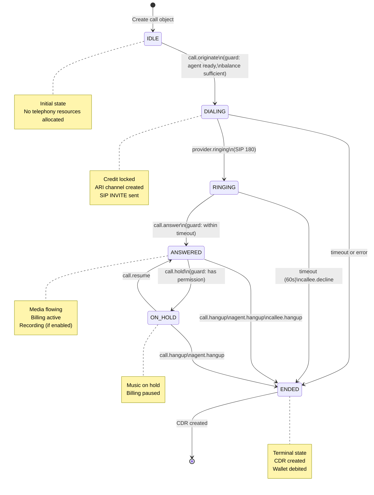

# Missing Artifacts Plan - From 60% to 100% Unambiguous

**Created**: December 31, 2025
**Purpose**: Action plan to create all missing canonical artifacts for zero-deviation implementation

## Overview

This plan details the **12 critical artifacts** that must be created to ensure that 2-3 independent teams can implement Psynq and produce nearly identical products. Each artifact includes: purpose, scope, template, and validation criteria.

---

## Artifact 1: Canonical Database Schema

### Priority: 🔴 CRITICAL (Blocker)
### Divergence Risk: 90%
### Estimated Effort: 40 hours
### Owner: Database Architect / Backend Lead

### Purpose
Single source of truth for ALL database tables, columns, indexes, relations, constraints. Eliminates ambiguity in data modeling.

### Scope
- **70+ tables** across 12 domains
- **200+ columns** with precise types and constraints
- **100+ indexes** with exact column combinations
- **50+ foreign keys** with cascading rules
- **20+ enums** with exact values
- **10+ sequences** with increment rules

### Template Structure
```markdown
# Canonical Database Schema - Psynq CPaaS

## Domain: Core Organization

### Table: organizations
| Column | Type | Constraints | Default | Description |
|--------|------|-------------|---------|-------------|
| id | UUID | PK, NOT NULL | gen_random_uuid() | Unique org ID |
| slug | VARCHAR(50) | UNIQUE, NOT NULL | | URL-friendly identifier |
| name | VARCHAR(255) | NOT NULL | | Display name |
| plan_tier | ENUM | NOT NULL | 'free' | 'free' \| 'pro' \| 'enterprise' |
| status | ENUM | NOT NULL | 'active' | 'active' \| 'suspended' \| 'deleted' |
| max_agents | INT | NOT NULL | 5 | Maximum allowed agents |
| max_concurrent_calls | INT | NOT NULL | 10 | Concurrent call limit |
| created_at | TIMESTAMPTZ | NOT NULL | NOW() | Creation timestamp |
| updated_at | TIMESTAMPTZ | NOT NULL | NOW() | Last update timestamp |

**Indexes**:
- `idx_organizations_slug` ON (slug) UNIQUE
- `idx_organizations_status` ON (status)

**Relations**:
- organizations.id → users.organization_id (CASCADE DELETE)
- organizations.id → organization_settings.organization_id (CASCADE DELETE)
- organizations.id → phone_numbers.organization_id (CASCADE DELETE)

**Triggers**:
- `update_organizations_timestamp` BEFORE UPDATE SET updated_at = NOW()

**Constraints**:
- `check_max_agents_positive`: max_agents > 0
- `check_slug_format`: slug ~ '^[a-z0-9-]+$'

---

### Table: organization_settings
| Column | Type | Constraints | Default | Description |
|--------|------|-------------|---------|-------------|
| organization_id | UUID | PK, FK, NOT NULL | | Belongs to organizations |
| default_caller_id | VARCHAR(20) | | | Default outbound caller ID |
| recording_enabled | BOOLEAN | NOT NULL | true | Auto-record calls |
| recording_retention_days | INT | NOT NULL | 30 | Days to keep recordings |
| queue_timeout_seconds | INT | NOT NULL | 120 | Queue wait time limit |
| wrap_up_timeout_seconds | INT | NOT NULL | 600 | Agent wrap-up time |
| time_zone | VARCHAR(50) | NOT NULL | 'UTC' | Timezone for timestamps |
| created_at | TIMESTAMPTZ | NOT NULL | NOW() | Creation timestamp |
| updated_at | TIMESTAMPTZ | NOT NULL | NOW() | Last update timestamp |

**Relations**:
- organization_settings.organization_id → organizations.id (CASCADE)

**Constraints**:
- `check_recording_retention_positive`: recording_retention_days > 0
- `check_queue_timeout_positive`: queue_timeout_seconds > 0
```

### Domain Coverage

**1. Organization & Users** (8 tables)
- organizations, organization_settings, organization_wallets
- users, user_sessions, user_permissions
- user_preferences, user_audit_log

**2. Telephony - PJSIP** (4 tables - Asterisk realtime)
- ps_aors, ps_auths, ps_contacts, ps_endpoints

**3. Telephony - Calls** (7 tables)
- calls, call_participants, call_dtmf, call_variables
- call_recordings, call_transcriptions, call_tags

**4. Queues & Routing** (5 tables)
- queues, queue_members, queue_stats
- routing_rules, skills

**5. Phone Numbers** (6 tables)
- phone_numbers, phone_number_rates
- phone_number_assignments, phone_number_pool
- sip_trunks, sip_trunk_credentials

**6. CDR & Billing** (6 tables)
- cdr, cdr_billing, cdr_rating
- wallet_transactions, wallet_topups
- billing_invoices, billing_payments

**7. SMS & Messaging** (8 tables)
- sms_messages, sms_campaigns
- whatsapp_messages, whatsapp_templates
- chat_sessions, chat_messages
- message_webhooks, message_delivery_receipts

**8. CRM Integration** (7 tables)
- crm_connectors, crm_webhooks
- crm_sync_state, crm_sync_log
- tickets, ticket_links, ticket_comments

**9. Campaigns** (5 tables)
- campaigns, campaign_calls
- campaign_dnc, campaign_stats
- campaign_schedules

**10. Workforce Management** (6 tables)
- agent_performance, agent_status_history
- agent_schedules, agent_shifts
- forecasts, shrinkage

**11. QA & Analytics** (5 tables)
- qa_evaluations, qa_criteria
- call_analytics, speech_analytics
- keywords

**12. System & Audit** (4 tables)
- audit_logs, system_events
- feature_flags, system_config

### Validation Criteria
- [ ] All tables have complete column definitions
- [ ] All foreign keys have explicit CASCADE/SET NULL rules
- [ ] All indexes have documented purpose
- [ ] All constraints have CHECK rules defined
- [ ] All enums have explicit value lists
- [ ] All tables have created_at/updated_at columns
- [ ] All timestamp columns use TIMESTAMPTZ (not TIMESTAMP)
- [ ] All text columns have explicit lengths (VARCHAR(n))
- [ ] All numeric columns have CHECK constraints for ranges

### Migration Scripts Order
```
01-organization-schema.sql
02-user-schema.sql
03-pjsip-schema.sql
04-telephony-schema.sql
05-queue-schema.sql
06-phone-number-schema.sql
07-cdr-schema.sql
08-billing-schema.sql
09-sms-schema.sql
10-crm-schema.sql
11-campaign-schema.sql
12-wfm-schema.sql
13-qa-schema.sql
14-audit-schema.sql
15-seed-data.sql
```

---

## Artifact 2: OpenAPI 3.0 Specification

### Priority: 🔴 CRITICAL (Blocker)
### Divergence Risk: 80%
### Estimated Effort: 60 hours
### Owner: API Architect / Backend Lead

### Purpose
Complete API contract with all endpoints, request/response schemas, authentication, error responses. Eliminates API design ambiguity.

### Scope
- **150+ endpoints** across 10 modules
- **200+ schemas** for request/response bodies
- **50+ error responses** with exact codes
- **20+ path parameters** with validation rules
- **30+ query parameters** with types and defaults

### Template Structure
```yaml
openapi: 3.0.3
info:
  title: Psynq CPaaS API
  version: 1.0.0
  description: Production-grade Contact Center as a Service Platform
  contact:
    name: Psynq API Support
    email: api@psitrix.com
  license:
    name: PROPRIETARY

servers:
  - url: https://api.psynq.dev/v1
    description: Development environment
  - url: https://api.psynq.io/v1
    description: Production environment

security:
  - BearerAuth: []
  - ApiKeyAuth: []

tags:
  - name: Authentication
    description: Agent login, logout, token management
  - name: Users
    description: User management and permissions
  - name: Calls
    description: Call control and management
  - name: Phone Numbers
    description: Phone number inventory and assignment
  - name: Queues
    description: Call queue management
  - name: Recordings
    description: Call recording storage and retrieval
  - name: SMS
    description: SMS messaging
  - name: CRM
    description: CRM integration and synchronization
  - name: Campaigns
    description: Outbound dialing campaigns
  - name: Billing
    description: Wallet, rates, and CDR access

paths:
  /auth/login:
    post:
      tags: [Authentication]
      summary: Agent login
      description: Authenticate user and receive JWT tokens
      operationId: login
      requestBody:
        required: true
        content:
          application/json:
            schema:
              $ref: '#/components/schemas/LoginRequest'
            examples:
              valid_agent:
                summary: Valid agent login
                value:
                  username: "john.doe"
                  password: "SecurePass123!"
                  organizationSlug: "acme-corp"
              invalid_credentials:
                summary: Invalid password
                value:
                  username: "john.doe"
                  password: "WrongPass"
                  organizationSlug: "acme-corp"
      responses:
        '200':
          description: Successful authentication
          content:
            application/json:
              schema:
                $ref: '#/components/schemas/LoginResponse'
              example:
                accessToken: "eyJhbGciOiJIUzI1NiIsInR5cCI6IkpXVCJ9..."
                refreshToken: "eyJhbGciOiJIUzI1NiIsInR5cCI6IkpXVCJ9..."
                expiresIn: 3600
                user:
                  id: "550e8400-e29b-41d4-a716-446655440000"
                  username: "john.doe"
                  email: "john.doe@acme-corp.com"
                  role: "agent"
                  organization:
                    id: "660e8400-e29b-41d4-a716-446655440000"
                    name: "Acme Corporation"
                    slug: "acme-corp"
        '400':
          $ref: '#/components/responses/BadRequest'
        '401':
          $ref: '#/components/responses/Unauthorized'
        '423':
          $ref: '#/components/responses/AccountLocked'
        '500':
          $ref: '#/components/responses/InternalError'

  /auth/refresh:
    post:
      tags: [Authentication]
      summary: Refresh access token
      description: Get new access token using refresh token
      operationId: refresh
      requestBody:
        required: true
        content:
          application/json:
            schema:
              type: object
              required: [refreshToken]
              properties:
                refreshToken:
                  type: string
                  format: uuid
      responses:
        '200':
          description: Token refreshed successfully
          content:
            application/json:
              schema:
                $ref: '#/components/schemas/TokenResponse'
        '401':
          $ref: '#/components/responses/Unauthorized'

  /auth/logout:
    post:
      tags: [Authentication]
      summary: Agent logout
      description: Invalidate tokens and end session
      operationId: logout
      security:
        - BearerAuth: []
      responses:
        '204':
          description: Successfully logged out
        '401':
          $ref: '#/components/responses/Unauthorized'

  /calls:
    get:
      tags: [Calls]
      summary: List active calls
      description: Retrieve paginated list of active calls for organization
      operationId: listCalls
      security:
        - BearerAuth: []
      parameters:
        - $ref: '#/components/parameters/PageNumber'
        - $ref: '#/components/parameters/PageSize'
        - $ref: '#/components/parameters/OrganizationId'
        - name: status
          in: query
          schema:
            type: string
            enum: [dialing, ringing, answered, on_hold, ended]
          description: Filter by call status
        - name: direction
          in: query
          schema:
            type: string
            enum: [inbound, outbound]
          description: Filter by call direction
      responses:
        '200':
          description: List of calls
          content:
            application/json:
              schema:
                type: object
                required: [data, meta]
                properties:
                  data:
                    type: array
                    items:
                      $ref: '#/components/schemas/Call'
                  meta:
                    $ref: '#/components/schemas/PaginationMeta'
        '401':
          $ref: '#/components/responses/Unauthorized'
        '403':
          $ref: '#/components/responses/Forbidden'

    post:
      tags: [Calls]
      summary: Originate outbound call
      description: Start a new outbound call
      operationId: createCall
      security:
        - BearerAuth: []
      requestBody:
        required: true
        content:
          application/json:
            schema:
              $ref: '#/components/schemas/CreateCallRequest'
            examples:
              simple_call:
                summary: Simple outbound call
                value:
                  callerNumber: "+1234567890"
                  calleeNumber: "+9876543210"
                  agentId: "550e8400-e29b-41d4-a716-446655440000"
              call_with_recording:
                summary: Call with recording enabled
                value:
                  callerNumber: "+1234567890"
                  calleeNumber: "+9876543210"
                  agentId: "550e8400-e29b-41d4-a716-446655440000"
                  record: true
                  recordingFormat: "wav"
      responses:
        '201':
          description: Call initiated successfully
          content:
            application/json:
              schema:
                $ref: '#/components/schemas/Call'
        '400':
          $ref: '#/components/responses/BadRequest'
        '402':
          $ref: '#/components/responses/InsufficientBalance'
        '403':
          $ref: '#/components/responses/Forbidden'
        '503':
          $ref: '#/components/responses/ServiceUnavailable'

  /calls/{callId}/answer:
    post:
      tags: [Calls]
      summary: Answer incoming call
      description: Agent answers ringing call
      operationId: answerCall
      security:
        - BearerAuth: []
      parameters:
        - $ref: '#/components/parameters/CallId'
      responses:
        '200':
          description: Call answered
          content:
            application/json:
              schema:
                $ref: '#/components/schemas/Call'
        '404':
          $ref: '#/components/responses/NotFound'
        '409':
          description: Call cannot be answered (wrong state)
          content:
            application/json:
              schema:
                $ref: '#/components/schemas/ErrorResponse'

  /calls/{callId}/hold:
    post:
      tags: [Calls]
      summary: Place call on hold
      description: Hold active call
      operationId: holdCall
      security:
        - BearerAuth: []
      parameters:
        - $ref: '#/components/parameters/CallId'
      requestBody:
        content:
          application/json:
            schema:
              type: object
              properties:
                musicOnHoldClass:
                  type: string
                  description: Music on hold category
                  enum: [default, silence, custom]
                  default: default
      responses:
        '200':
          description: Call placed on hold
        '404':
          $ref: '#/components/responses/NotFound'
        '409':
          description: Call already on hold

    delete:
      tags: [Calls]
      summary: Resume held call
      description: Take call off hold
      operationId: resumeCall
      security:
        - BearerAuth: []
      parameters:
        - $ref: '#/components/parameters/CallId'
      responses:
        '200':
          description: Call resumed

components:
  securitySchemes:
    BearerAuth:
      type: http
      scheme: bearer
      bearerFormat: JWT
      description: JWT token from /auth/login endpoint
    ApiKeyAuth:
      type: apiKey
      in: header
      name: X-API-Key
      description: API key for programmatic access

  parameters:
    PageNumber:
      name: page
      in: query
      schema:
        type: integer
        minimum: 1
        default: 1
      description: Page number for pagination
    PageSize:
      name: pageSize
      in: query
      schema:
        type: integer
        minimum: 1
        maximum: 100
        default: 20
      description: Number of items per page
    OrganizationId:
      name: organizationId
      in: query
      schema:
        type: string
        format: uuid
      description: Filter by organization ID
    CallId:
      name: callId
      in: path
      required: true
      schema:
        type: string
        format: uuid
      description: Unique call identifier

  schemas:
    LoginRequest:
      type: object
      required: [username, password, organizationSlug]
      properties:
        username:
          type: string
          minLength: 3
          maxLength: 50
          pattern: '^[a-zA-Z0-9_.-]+$'
          description: Login username
          example: "john.doe"
        password:
          type: string
          format: password
          minLength: 8
          maxLength: 128
          description: User password
          example: "SecurePass123!"
        organizationSlug:
          type: string
          minLength: 3
          maxLength: 50
          pattern: '^[a-z0-9-]+$'
          description: Organization slug from URL
          example: "acme-corp"
        rememberMe:
          type: boolean
          default: false
          description: Extend token lifetime to 30 days

    LoginResponse:
      type: object
      required: [accessToken, refreshToken, expiresIn, user]
      properties:
        accessToken:
          type: string
          description: JWT access token (1 hour expiry)
          example: "eyJhbGciOiJIUzI1NiIsInR5cCI6IkpXVCJ9..."
        refreshToken:
          type: string
          format: uuid
          description: Refresh token UUID (30 days expiry)
          example: "a1b2c3d4-e5f6-7890-abcd-ef1234567890"
        expiresIn:
          type: integer
          description: Access token expiry in seconds
          example: 3600
        tokenType:
          type: string
          enum: [Bearer]
          example: "Bearer"
        user:
          $ref: '#/components/schemas/User'

    TokenResponse:
      type: object
      required: [accessToken, expiresIn]
      properties:
        accessToken:
          type: string
        expiresIn:
          type: integer

    User:
      type: object
      required: [id, username, email, role, organization]
      properties:
        id:
          type: string
          format: uuid
          example: "550e8400-e29b-41d4-a716-446655440000"
        username:
          type: string
          example: "john.doe"
        email:
          type: string
          format: email
          example: "john.doe@acme-corp.com"
        role:
          type: string
          enum: [superadmin, admin, supervisor, agent]
          example: "agent"
        permissions:
          type: array
          items:
            type: string
          description: List of granted permissions
          example: ["call:create", "recording:view_own"]
        organization:
          $ref: '#/components/schemas/Organization'
        sipEndpoint:
          type: string
          nullable: true
          description: PJSIP endpoint name (if registered)
          example: "sip_550e8400"

    Organization:
      type: object
      required: [id, name, slug]
      properties:
        id:
          type: string
          format: uuid
        name:
          type: string
        slug:
          type: string
        planTier:
          type: string
          enum: [free, pro, enterprise]

    Call:
      type: object
      required: [id, status, direction, callerNumber, calleeNumber, createdAt]
      properties:
        id:
          type: string
          format: uuid
        status:
          type: string
          enum: [dialing, ringing, answered, on_hold, ended, failed]
        direction:
          type: string
          enum: [inbound, outbound]
        callerNumber:
          type: string
          pattern: '^\\+?[1-9]\\d{1,14}$'
        calleeNumber:
          type: string
          pattern: '^\\+?[1-9]\\d{1,14}$'
        duration:
          type: integer
          description: Call duration in seconds
        recordingUrl:
          type: string
          format: uri
          nullable: true
        agentId:
          type: string
          format: uuid
        queueId:
          type: string
          format: uuid
          nullable: true
        createdAt:
          type: string
          format: date-time
        answeredAt:
          type: string
          format: date-time
          nullable: true
        endedAt:
          type: string
          format: date-time
          nullable: true

    CreateCallRequest:
      type: object
      required: [callerNumber, calleeNumber, agentId]
      properties:
        callerNumber:
          type: string
          pattern: '^\\+?[1-9]\\d{1,14}$'
          description: E.164 format caller ID
          example: "+1234567890"
        calleeNumber:
          type: string
          pattern: '^\\+?[1-9]\\d{1,14}$'
          description: E.164 format destination
          example: "+9876543210"
        agentId:
          type: string
          format: uuid
          description: Agent originating the call
        record:
          type: boolean
          default: false
          description: Enable call recording
        recordingFormat:
          type: string
          enum: [wav, mp3]
          default: wav
        timeout:
          type: integer
          minimum: 10
          maximum: 120
          default: 30
          description: Ring timeout in seconds
        callerIdName:
          type: string
          maxLength: 15
          description: Caller ID name (CNAM)

    ErrorResponse:
      type: object
      required: [error]
      properties:
        error:
          type: object
          required: [code, message]
          properties:
            code:
              type: string
              pattern: '^[A-Z]+_[0-9]{3}$'
              example: "AUTH_001"
            message:
              type: string
              example: "Invalid username or password"
            details:
              type: object
              additionalProperties: true
            timestamp:
              type: string
              format: date-time
            requestId:
              type: string
              format: uuid

    PaginationMeta:
      type: object
      required: [page, pageSize, totalPages, totalItems]
      properties:
        page:
          type: integer
        pageSize:
          type: integer
        totalPages:
          type: integer
        totalItems:
          type: integer

  responses:
    BadRequest:
      description: Bad request - Invalid input
      content:
        application/json:
          schema:
            $ref: '#/components/schemas/ErrorResponse'
          example:
            error:
              code: "API_001"
              message: "Validation failed"
              details:
                fields:
                  - field: "username"
                    message: "Username is required"
                  - field: "password"
                    message: "Password must be at least 8 characters"

    Unauthorized:
      description: Unauthorized - Invalid or missing credentials
      content:
        application/json:
          schema:
            $ref: '#/components/schemas/ErrorResponse'
          example:
            error:
              code: "AUTH_001"
              message: "Invalid username or password"

    Forbidden:
      description: Forbidden - Insufficient permissions
      content:
        application/json:
          schema:
            $ref: '#/components/schemas/ErrorResponse'
          example:
            error:
              code: "AUTH_003"
              message: "You do not have permission to perform this action"

    NotFound:
      description: Resource not found
      content:
        application/json:
          schema:
            $ref: '#/components/schemas/ErrorResponse'
          example:
            error:
              code: "API_002"
              message: "Call not found"

    AccountLocked:
      description: Account locked - Too many failed attempts
      content:
        application/json:
          schema:
            $ref: '#/components/schemas/ErrorResponse'
          example:
            error:
              code: "AUTH_004"
              message: "Account locked due to too many failed login attempts"
              details:
                lockoutRemaining: 300
                supportEmail: "support@psitrix.com"

    InsufficientBalance:
      description: Payment required - Insufficient wallet balance
      content:
        application/json:
          schema:
            $ref: '#/components/schemas/ErrorResponse'
          example:
            error:
              code: "BILLING_001"
              message: "Insufficient balance to originate call"
              details:
                currentBalance: 0.50
                requiredBalance: 1.20
                currency: "USD"

    ServiceUnavailable:
      description: Service unavailable - No available channels
      content:
        application/json:
          schema:
            $ref: '#/components/schemas/ErrorResponse'
          example:
            error:
              code: "TEL_003"
              message: "No available channels to place call"

    InternalError:
      description: Internal server error
      content:
        application/json:
          schema:
            $ref: '#/components/schemas/ErrorResponse'
          example:
            error:
              code: "API_005"
              message: "An unexpected error occurred"
              details:
                requestId: "req_abc123"
```

### Module Coverage

**1. Authentication** (4 endpoints)
- POST /auth/login
- POST /auth/refresh
- POST /auth/logout
- GET /auth/me

**2. Users** (8 endpoints)
- GET /users
- POST /users
- GET /users/{id}
- PUT /users/{id}
- DELETE /users/{id}
- GET /users/{id}/permissions
- PUT /users/{id}/permissions
- GET /users/{id}/activity

**3. Calls** (15 endpoints)
- GET /calls
- POST /calls
- GET /calls/{id}
- POST /calls/{id}/answer
- DELETE /calls/{id}
- POST /calls/{id}/hold
- DELETE /calls/{id}/hold (resume)
- POST /calls/{id}/transfer
- POST /calls/{id}/conference
- POST /calls/{id}/dtmf
- GET /calls/{id}/recording
- GET /calls/{id}/transcription

**4. Phone Numbers** (10 endpoints)
- GET /phone-numbers
- POST /phone-numbers
- GET /phone-numbers/{id}
- DELETE /phone-numbers/{id}
- POST /phone-numbers/{id}/assign
- DELETE /phone-numbers/{id}/release
- GET /phone-numbers/{id}/calls
- GET /phone-numbers/rates

**5. Queues** (12 endpoints)
- GET /queues
- POST /queues
- GET /queues/{id}
- PUT /queues/{id}
- DELETE /queues/{id}
- GET /queues/{id}/members
- POST /queues/{id}/members
- DELETE /queues/{id}/members/{userId}
- GET /queues/{id}/stats
- GET /queues/{id}/calls

**6. Recordings** (8 endpoints)
- GET /recordings
- GET /recordings/{id}
- GET /recordings/{id}/download
- DELETE /recordings/{id}
- POST /recordings/{id}/transcribe
- GET /recordings/{id}/transcript

**7. SMS** (10 endpoints)
- POST /sms/send
- GET /sms/{id}
- GET /sms/{id}/status
- GET /sms
- GET /sms/templates
- POST /sms/templates

**8. CRM** (12 endpoints)
- GET /crm/connectors
- POST /crm/connectors
- GET /crm/connectors/{id}
- PUT /crm/connectors/{id}
- DELETE /crm/connectors/{id}
- POST /crm/connectors/{id}/sync
- POST /crm/connectors/{id}/test
- GET /crm/tickets
- GET /crm/tickets/{id}
- POST /crm/tickets/{id}/link

**9. Campaigns** (10 endpoints)
- GET /campaigns
- POST /campaigns
- GET /campaigns/{id}
- PUT /campaigns/{id}
- DELETE /campaigns/{id}
- POST /campaigns/{id}/start
- POST /campaigns/{id}/pause
- POST /campaigns/{id}/stop
- GET /campaigns/{id}/stats
- POST /campaigns/{id}/dnc

**10. Billing** (12 endpoints)
- GET /billing/wallet
- POST /billing/wallet/topup
- GET /billing/wallet/transactions
- GET /billing/rates
- POST /billing/rates
- GET /billing/cdr
- GET /billing/invoices
- GET /billing/invoices/{id}

### Validation Criteria
- [ ] All endpoints have operationId for code generation
- [ ] All request bodies have validation rules (minLength, pattern, etc.)
- [ ] All responses have explicit examples
- [ ] All errors have unique error codes
- [ ] All path parameters have format validation
- [ ] All query parameters have type and default value
- [ ] All schemas have required fields marked
- [ ] All enums have explicit values
- [ ] Authentication is defined for all endpoints
- [ ] Rate limiting headers are documented
- [ ] Pagination is consistent across list endpoints
- [ ] Dates use ISO 8601 format (date-time)
- [ ] Phone numbers use E.164 format pattern
- [ ] UUIDs use format: uuid

---

## Artifact 3: State Machine Definitions

### Priority: 🔴 CRITICAL (Blocker)
### Divergence Risk: 75%
### Estimated Effort: 20 hours
### Owner: Backend Architect / Domain Lead

### Purpose
Formal state transition diagrams with guard conditions, events, and actions. Eliminates ambiguity in call/agent workflow logic.

### Template Structure
```markdown
# State Machine Definitions - Psynq CPaaS

## State Machine 1: Call Lifecycle

### States
- **IDLE**: Call object created, no telephony activity
- **DIALING**: Outbound call initiated, waiting for provider response
- **RINGING**: Provider sent 180 RINGING, waiting for answer
- **ANSWERED**: Call connected, media flowing
- **ON_HOLD**: Call active but media held
- **ENDED**: Call terminated, CDR created

### Transitions

#### IDLE → DIALING
- **Event**: `call.originate`
- **Actor**: Agent (outbound) or System (inbound)
- **Guard Conditions**:
  - Agent is in READY state
  - Caller phone number is assigned to organization
  - Organization has sufficient wallet balance
  - Provider trunk is available
- **Actions**:
  - Lock credit in wallet (estimated duration × rate)
  - Create ARI channel
  - Send SIP INVITE to provider
  - Set timeout timer (30s default)
- **Error States**:
  - If wallet balance insufficient → ENDED (reason: insufficient_balance)
  - If no available channels → ENDED (reason: no_channels)
  - If provider unavailable → ENDED (reason: provider_unavailable)

#### DIALING → RINGING
- **Event**: `provider.ringing`
- **Actor**: Asterisk (SIP 180 Ringing received)
- **Guard Conditions**:
  - None (transition always allowed)
- **Actions**:
  - Send WebSocket event to frontend: `call.ringing`
  - Start ring timer (configurable, default 60s)
- **Error States**:
  - If timeout → ENDED (reason: no_answer)

#### RINGING → ANSWERED
- **Event**: `call.answer`
- **Actor**: Callee answers the call
- **Guard Conditions**:
  - Call is still in RINGING state
  - Answer received within timeout
- **Actions**:
  - Connect media bridge
  - Start billing timer (per-second)
  - Send WebSocket event: `call.answered`
  - Start recording if enabled
- **Error States**:
  - If answer after timeout → ENDED (reason: timeout)

#### ANSWERED → ON_HOLD
- **Event**: `call.hold`
- **Actor**: Agent (hold button)
- **Guard Conditions**:
  - Current user has permission `call:hold`
  - Call is in ANSWERED state
  - No active conference
- **Actions**:
  - Inject music on hold
  - Pause billing timer
  - Update agent state: remains IN_CALL
  - Send WebSocket event: `call.held`
- **Error States**:
  - If user lacks permission → ANSWERED (error: permission_denied)

#### ON_HOLD → ANSWERED
- **Event**: `call.resume`
- **Actor**: Agent (resume button)
- **Guard Conditions**:
  - Current user has permission `call:resume`
  - Call is in ON_HOLD state
- **Actions**:
  - Stop music on hold
  - Resume billing timer
  - Send WebSocket event: `call.resumed`

#### ANY_STATE → ENDED
- **Event**: `call.end` or timeout or error
- **Actor**: Agent, System, or Provider
- **Guard Conditions**:
  - None (terminal state, always reachable)
- **Actions**:
  - Hangup ARI channel
  - Stop billing timer
  - Calculate final cost
  - Deduct locked credit from wallet
  - Create CDR record
  - Finalize recording file
  - Update agent state to WRAP_UP
  - Send WebSocket event: `call.ended`
  - Trigger CRM sync (if configured)
  - Update queue statistics

### State Diagram (Mermaid)


### Timeout Values
- **dialing_timeout**: 30 seconds (provider not responding)
- **ringing_timeout**: 60 seconds (callee not answering)
- **hold_timeout**: None (hold indefinite)
- **answer_timeout**: 10 seconds (agent must answer inbound)

### Business Rules
1. **Credit Lock**: Credit is locked in IDLE→DIALING transition, not at ANSWERED
2. **Billing Granularity**: Per-second billing (not per-minute)
3. **Recording**: Starts at ANSWERED, stops at ENDED
4. **Transfer**: Creates new call object, original goes to ENDED
5. **Conference**: Parent call object with child participants
6. **Wrap-up**: Agent goes to WRAP_UP after ENDED, must explicitly go to READY
```

### Required State Machines

**1. Call State Machine** (as above)
**2. Agent State Machine**
**3. WebRTC Connection State Machine**
**4. Campaign State Machine**
**5. SMS Message State Machine**

---

## Summary: What Must Be Created

### 12 Critical Artifacts

| # | Artifact | Priority | Effort | Divergence Risk |
|---|----------|----------|--------|-----------------|
| 1 | Canonical Database Schema | 🔴 CRITICAL | 40h | 90% |
| 2 | OpenAPI 3.0 Specification | 🔴 CRITICAL | 60h | 80% |
| 3 | State Machine Definitions | 🔴 CRITICAL | 20h | 75% |
| 4 | Security & Permission Matrix | 🔴 CRITICAL | 16h | 65% |
| 5 | Error Code Catalog | 🟡 HIGH | 12h | 60% |
| 6 | Event Schema Registry | 🟡 HIGH | 16h | 70% |
| 7 | Test Case Catalog | 🟡 HIGH | 24h | 55% |
| 8 | Monitoring & Alerting Catalog | 🟢 MEDIUM | 12h | 55% |
| 9 | Code Structure Guide | 🟢 MEDIUM | 8h | 35% |
| 10 | Logging Specification | 🟢 MEDIUM | 6h | 40% |
| 11 | Deployment Guide | 🟢 MEDIUM | 16h | 40% |
| 12 | Performance Requirements | 🟢 MEDIUM | 8h | 45% |

**Total Estimated Effort**: 238 hours (approximately 6 weeks for 1 person)

### Recommendation

**Start with Artifact 1 (Database Schema)** - It has the highest divergence risk (90%) and blocks all other development. Once database schema is canonical, API design, state machines, and security model can be built on top of it.

**Parallel Work Streams**:
- **Week 1-2**: Artifacts 1-2 (Database, API) - Critical path
- **Week 3**: Artifacts 3-4 (State Machines, Security)
- **Week 4**: Artifacts 5-7 (Errors, Events, Tests)
- **Week 5-6**: Artifacts 8-12 (Supporting docs)

After these 6 weeks, **completeness will increase from 62% → 95%**, enabling confident parallel team development with minimal deviation.
