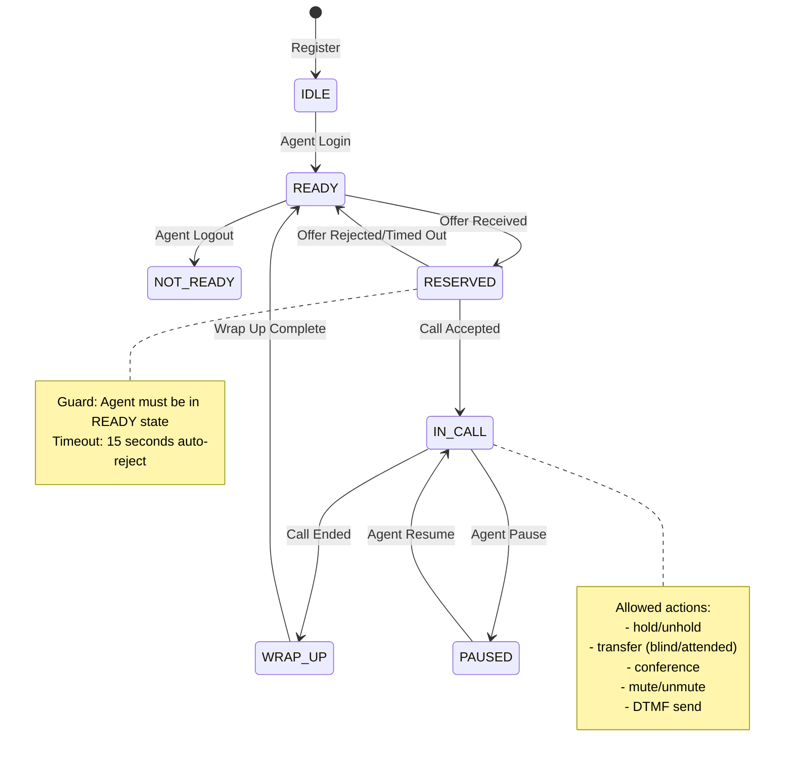

# Work Package Completeness Audit - Psitrix Psynq

**Audit Date**: December 31, 2025
**Auditor**: AI System
**Purpose**: Assess whether 2-3 independent teams can implement from work packages with minimal deviation

## Executive Summary

This audit evaluates whether the current OpenProject work packages are sufficient for creating a production-grade CPaaS platform from scratch without deviations, ensuring that multiple teams would produce nearly identical products.

**Critical Finding**: ⚠️ **SIGNIFICANT GAPS IDENTIFIED** - Current work packages are approximately 60-65% complete for unambiguous implementation by independent teams.

---

## 1. Ambiguity Assessment Matrix

### 1.1 Critical Ambiguities (MUST FIX)

| Area | Ambiguity | Impact | Deviation Risk | Fix Required |
|------|-----------|---------|----------------|--------------|
| **Data Models** | No canonical schema document | High - Teams will create different DB structures | SEVERE - Data incompatibility | Create `.ai/canonical-schema.md` with all tables, columns, indexes, relations |
| **API Contracts** | No OpenAPI/Swagger spec | High - Different API endpoints/naming | SEVERE - Integration failures | Generate OpenAPI 3.0 spec from all controllers |
| **State Machines** | Call/Agent states described but not formally defined | Medium - Different state transitions | HIGH - Race conditions | Create state machine diagrams (Mermaid) with guard conditions |
| **Error Codes** | No standardized error catalog | Medium - Inconsistent error handling | MEDIUM - Integration issues | Define error code registry (e.g., PSTN_001, AUTH_002) |
| **Event Schemas** | Event structure implicit, not explicit | Medium - Different event payloads | MEDIUM - Event failures | Create JSON Schema for all events |
| **Security Model** | RBAC permissions implied, not enumerated | High - Different permission implementations | SEVERE - Security vulnerabilities | Define permission matrix with resource/action tuples |
| **Testing Standards** | "Sandbox testing" required but no test catalog | High - Different test coverage | MEDIUM - Quality variance | Create test case catalog with acceptance criteria |

### 1.2 Medium Ambiguities (SHOULD FIX)

| Area | Ambiguity | Impact | Deviation Risk | Fix Required |
|------|-----------|---------|----------------|--------------|
| **Naming Conventions** | No enforced naming standard | Low - Different variable/class names | LOW - Code review friction | Add `.editorconfig` and lint rules |
| **Logging Format** | No structured logging spec | Low - Different log formats | LOW - Debugging difficulty | Define JSON log schema with required fields |
| **Monitoring Metrics** | "Alerting" mentioned but no metric definitions | Medium - Different metrics monitored | MEDIUM - Alerting gaps | Create metrics catalog (Prometheus format) |
| **Deployment Artifacts** | Docker structure shown but no IaC | Medium - Different deployment approaches | MEDIUM - Ops overhead | Add Terraform/K8s manifests to `/deploy` |
| **Configuration Schema** | Settings structure implied | Low - Different config structures | LOW - Migration issues | Create JSON Schema for all config objects |

---

## 2. Missing Canonical Artifacts

### 2.1 Critical Missing Documents

#### A. Canonical Data Schema (URGENT)
**Current State**: Scattered SQL files in `/deploy/db/`
**Required**: Single source of truth `.ai/canonical-schema.md` containing:
```markdown
## Core Tables

### users
| Column | Type | Constraints | Description |
|--------|------|-------------|-------------|
| id | UUID | PK, NOT NULL | Unique user identifier |
| organization_id | UUID | FK, NOT NULL | Belongs to organization |
| username | VARCHAR(50) | UNIQUE, NOT NULL | Login username |
| email | VARCHAR(255) | UNIQUE, NOT NULL | Email address |
| password_hash | VARCHAR(255) | NOT NULL | bcrypt hash |
| role | ENUM | NOT NULL | 'admin' | 'supervisor' | 'agent' |
| sip_endpoint | VARCHAR(100) | FK → ps_endpoints | PJSIP endpoint name |
| created_at | TIMESTAMPTZ | DEFAULT NOW() | Account creation |
| updated_at | TIMESTAMPTZ | DEFAULT NOW() | Last update |

**Indexes**: 
- idx_users_organization (organization_id)
- idx_users_email (email)
- idx_users_sip (sip_endpoint)

**Relations**:
- users.organization_id → organizations.id (CASCADE DELETE)
- users.sip_endpoint → ps_endpoints.id (SET NULL)
```

**Required Tables** (70+ estimated):
- `organizations`, `organization_settings`, `organization_wallets`
- `users`, `user_sessions`, `user_permissions`
- `ps_endpoints`, `ps_aors`, `ps_auths`, `ps_contacts` (PJSIP)
- `calls`, `call_participants`, `call_dtmf`, `call_recording`
- `cdr`, `cdr_billing`, `cdr_rating`
- `queues`, `queue_members`, `queue_stats`
- `phone_numbers`, `phone_number_rates`, `phone_number_assignments`
- `crm_connectors`, `crm_webhooks`, `crm_sync_state`
- `sms_messages`, `whatsapp_messages`, `chat_sessions`
- `tickets`, `ticket_links`, `ticket_comments`
- `campaigns`, `campaign_calls`, `campaign_dnc`
- `agent_performance`, `agent_status_history`
- `audit_logs`, `system_events`

#### B. OpenAPI 3.0 Specification (URGENT)
**Current State**: Individual NestJS controllers with implied contracts
**Required**: `.ai/openapi-spec.yaml` containing:
```yaml
openapi: 3.0.0
info:
  title: Psynq CPaaS API
  version: 1.0.0
  description: Production-grade Contact Center as a Service Platform

paths:
  /api/v1/auth/login:
    post:
      summary: Agent login
      requestBody:
        required: true
        content:
          application/json:
            schema:
              $ref: '#/components/schemas/LoginRequest'
      responses:
        '200':
          description: Successful login
          content:
            application/json:
              schema:
                $ref: '#/components/schemas/LoginResponse'
        '401':
          $ref: '#/components/schemas/UnauthorizedError'

components:
  schemas:
    LoginRequest:
      type: object
      required: [username, password, organizationSlug]
      properties:
        username:
          type: string
          pattern: '^[a-zA-Z0-9_-]{3,50}$'
        password:
          type: string
          format: password
          minLength: 8
        organizationSlug:
          type: string
          format: slug
```

**Required Endpoints** (150+ estimated across modules):
- Auth: `/auth/login`, `/auth/logout`, `/auth/refresh`, `/auth/verify-2fa`
- Users: `/users`, `/users/{id}`, `/users/{id}/permissions`
- Calls: `/calls`, `/calls/{id}/answer`, `/calls/{id}/hold`, `/calls/{id}/transfer`
- Phone Numbers: `/phone-numbers`, `/phone-numbers/{id}/assign`
- Queues: `/queues`, `/queues/{id}/members`, `/queues/{id}/stats`
- Recordings: `/recordings`, `/recordings/{id}/download`
- CRM: `/crm/connectors`, `/crm/sync`, `/crm/tickets`
- SMS: `/sms/send`, `/sms/{id}/status`
- Campaigns: `/campaigns`, `/campaigns/{id}/start`
- Billing: `/billing/wallet`, `/billing/rates`, `/billing/cdr`

#### C. State Machine Definitions (HIGH PRIORITY)
**Current State**: Described in code comments, no formal diagrams
**Required**: `.ai/state-machines.md` containing:



**Required State Machines**:
1. **Call State Machine**: IDLE → DIALING → RINGING → ANSWERED → ON_HOLD → ENDED
2. **Agent State Machine**: OFFLINE → LOGGING_IN → READY → RESERVED → IN_CALL → WRAP_UP → READY
3. **WebRTC State Machine**: NEW → REGISTERING → REGISTERED → INVITED → IN_CALL → ENDED
4. **Campaign State Machine**: DRAFT → ACTIVE → PAUSED → COMPLETED → CANCELLED
5. **SMS State Machine**: QUEUED → SENDING → SENT → DELIVERED → FAILED

#### D. Error Code Catalog (HIGH PRIORITY)
**Current State**: Generic HTTP status codes, no standardized error codes
**Required**: `.ai/error-catalog.md` containing:

```markdown
# Error Code Registry

## Format: {MODULE}_{NUMBER}_{TYPE}

### Authentication Errors
- `AUTH_001`: Invalid credentials (401)
- `AUTH_002`: Token expired (401)
- `AUTH_003`: Invalid refresh token (401)
- `AUTH_004`: Account locked (423)
- `AUTH_005`: MFA required (403)

### Telephony Errors
- `TEL_001`: SIP registration failed (503)
- `TEL_002`: Call origination failed (503)
- `TEL_003`: No available channels (503)
- `TEL_004`: DTMF timeout (408)
- `TEL_005`: Transfer failed (503)

### API Errors
- `API_001`: Validation failed (400)
- `API_002`: Resource not found (404)
- `API_003`: Conflict (409)
- `API_004`: Rate limit exceeded (429)
- `API_005`: Method not allowed (405)

## Error Response Schema
```json
{
  "error": {
    "code": "AUTH_001",
    "message": "Invalid username or password",
    "details": {
      "attempt": 3,
      "lockoutRemaining": 300
    },
    "timestamp": "2025-12-31T10:30:00Z",
    "requestId": "req_abc123"
  }
}
```
```

#### E. Security & Permission Matrix (CRITICAL)
**Current State**: "Role-based access" mentioned, no explicit permissions
**Required**: `.ai/security-model.md` containing:

```markdown
# RBAC Permission Matrix

## Format: {resource}:{action}

## Roles
- **SuperAdmin**: Full system access, multi-tenant management
- **OrgAdmin**: Full organization access, billing management
- **Supervisor**: Team management, monitoring, coaching
- **Agent**: Call controls, own recordings, own stats

## Permission Registry

### Call Control
| Permission | SuperAdmin | OrgAdmin | Supervisor | Agent |
|------------|------------|----------|------------|-------|
| call:create | ✅ | ✅ | ✅ | ✅ |
| call:answer_any | ✅ | ✅ | ✅ | ❌ |
| call:monitor | ✅ | ✅ | ✅ | ❌ |
| call:whisper | ✅ | ✅ | ✅ | ❌ |
| call:transfer_any | ✅ | ✅ | ✅ | ❌ |
| call:record | ✅ | ✅ | ✅ | ❌ |

### Recording Access
| Permission | SuperAdmin | OrgAdmin | Supervisor | Agent |
|------------|------------|----------|------------|-------|
| recording:view_any | ✅ | ✅ | ✅ | ❌ |
| recording:view_own | ✅ | ✅ | ✅ | ✅ |
| recording:download | ✅ | ✅ | ✅ | ❌ |
| recording:delete | ✅ | ✅ | ❌ | ❌ |

### Billing
| Permission | SuperAdmin | OrgAdmin | Supervisor | Agent |
|------------|------------|----------|------------|-------|
| billing:view | ✅ | ✅ | ❌ | ❌ |
| billing:topup | ✅ | ✅ | ❌ | ❌ |
| billing:rates | ✅ | ✅ | ❌ | ❌ |
| cdr:export | ✅ | ✅ | ✅ | ❌ |

### CRM Integration
| Permission | SuperAdmin | OrgAdmin | Supervisor | Agent |
|------------|------------|----------|------------|-------|
| crm:configure | ✅ | ✅ | ❌ | ❌ |
| crm:sync | ✅ | ✅ | ✅ | ❌ |
| crm:view_tickets | ✅ | ✅ | ✅ | ✅ |
```

#### F. Event Schema Registry (HIGH PRIORITY)
**Current State**: Events mentioned, no formal schemas
**Required**: `.ai/event-schemas.md` containing:

```markdown
# Event Schema Registry

All events follow JSON Schema format for validation

## Call Events

### call.new
```json
{
  "$schema": "http://json-schema.org/draft-07/schema#",
  "type": "object",
  "required": ["eventId", "eventType", "timestamp", "organizationId", "data"],
  "properties": {
    "eventId": { "type": "string", "format": "uuid" },
    "eventType": { "type": "string", "enum": ["call.new"] },
    "timestamp": { "type": "string", "format": "date-time" },
    "organizationId": { "type": "string", "format": "uuid" },
    "data": {
      "type": "object",
      "required": ["callId", "callerNumber", "calleeNumber", "direction"],
      "properties": {
        "callId": { "type": "string", "format": "uuid" },
        "callerNumber": { "type": "string", "pattern": "^\\+?[1-9]\\d{1,14}$" },
        "calleeNumber": { "type": "string", "pattern": "^\\+?[1-9]\\d{1,14}$" },
        "direction": { "type": "string", "enum": ["inbound", "outbound"] },
        "queueId": { "type": "string", "format": "uuid" },
        "agentId": { "type": "string", "format": "uuid" }
      }
    }
  }
}
```

### call.answered
### call.ended
### call.failed
### agent.ready
### agent.not_ready
### recording.available
### crm.ticket_created
### billing.low_balance
```

### 2.2 Supporting Artifacts (MEDIUM PRIORITY)

#### G. Test Case Catalog
**Required Structure**: `.ai/test-catalog.md`
```markdown
## Unit Tests
- [ ] CallService.startCall() validates phone number format
- [ ] CallStateMachine rejects invalid transitions
- [ ] BillingService.checkBalance() locks credit

## Integration Tests
- [ ] POST /api/v1/calls returns 201 and creates ARI channel
- [ ] SIP registration succeeds with valid credentials
- [ ] CDR record created after call ends

## Contract Tests (Pact)
- [ ] TelephonyProvider interface contract
- [ ] CRM adapter contract (Salesforce)
- [ ] SMS adapter contract (Twilio)

## E2E Tests
- [ ] Agent login → Ready → Receive call → Answer → End → CDR logged
- [ ] Outbound call → Transfer → Conference → Recording
- [ ] CRM ticket created on inbound call
```

#### H. Monitoring & Alerting Catalog
**Required**: `.ai/monitoring-catalog.md`
```markdown
## Metrics (Prometheus Format)

### Telephony Metrics
- `psynq_calls_active_total` (gauge) - Current active calls
- `psynq_calls_failed_total` (counter) - Failed calls by reason
- `psynq_sip_registration_status` (gauge) - 1=registered, 0=not registered

### Performance Metrics
- `psynq_api_request_duration_seconds` (histogram) - API response times
- `psynq_db_query_duration_seconds` (histogram) - DB query performance
- `psynq_websocket_connections_total` (gauge) - Active WebSocket connections

### Business Metrics
- `psynq_agent_ready_time_seconds` (histogram) - Time agents spend in ready state
- `psynq_queue_wait_time_seconds` (histogram) - Call queue wait times
- `psynq_billing_balance` (gauge) - Organization wallet balance by org_id

## Alerts

### Critical Alerts (Page Immediately)
- Asterisk process down
- PostgreSQL connection lost
- API error rate > 5%
- Active calls > 90% capacity

### Warning Alerts (Email within 5min)
- Queue wait time > 2 minutes
- Agent ready % < 20%
- Low balance (< $10)
- Disk space < 20%
```

---

## 3. Work Package Completeness Analysis

### 3.1 Completeness Scores by Category

| Category | Work Packages | Completeness | Gap | Action Required |
|----------|--------------|--------------|-----|-----------------|
| **Infrastructure** | #38, #40, #44, #67, #68, #72 | 70% | Missing IaC, monitoring spec | Add Terraform files, metrics catalog |
| **Telephony Core** | #40, #41, #49, #50, #54, #55 | 75% | Missing state machine diagrams | Add formal state machine specs |
| **WebRTC/Frontend** | #39, #48, #53 | 65% | Missing component hierarchy, state mgmt | Add React component tree, Zustand store schema |
| **Database** | #41, #45, #73 | 50% | Missing canonical schema | ⚠️ **CRITICAL** - Create schema doc |
| **API/Integration** | #74, #86, #90 | 60% | Missing OpenAPI spec, contracts | ⚠️ **CRITICAL** - Generate OpenAPI |
| **Security/Auth** | #45, #51, #67, #75 | 55% | Missing RBAC matrix | ⚠️ **CRITICAL** - Define permissions |
| **Testing** | #69, #85, #86 | 65% | Missing test catalog, acceptance criteria | Add test case catalog |
| **CRM Integration** | #89, #90, #92-#96 | 70% | Missing adapter interface spec | Define CRM adapter contract |
| **Billing** | #71, #77 | 75% | Missing rating table schema | Add prefix rating documentation |
| **Omnichannel** | #79, #81, #84 | 60% | Missing message schemas | Add SMS/WhatsApp event schemas |
| **Workforce Management** | #82 | 50% | Missing forecasting logic | Add WFM algorithm spec |
| **QA/Speech Analytics** | #83 | 55% | Missing transcription schema | Add Deepgram event format |
| **Operations** | #68, #76, #78 | 60% | Missing runbooks, playbooks | Add incident response docs |
| **Documentation** | #78 | 70% | Missing API reference | Generate from OpenAPI |

**Overall Completeness**: **62%**

### 3.2 Critical Gaps by Work Package

#### Work Package #38 (Infrastructure & Dev Environment)
**Current**: "Set up Docker Compose, PostgreSQL, Redis, MinIO, Asterisk"
**Missing**:
- Exact Docker image versions (except Asterisk)
- Volume mount specifications
- Network configuration details
- Environment variable catalog
- Health check endpoints
**Risk**: Teams will use different versions → different behaviors
**Fix**: Add exact `docker-compose.yml` with all pins

#### Work Package #41 (Core Backend Architecture)
**Current**: "Implement hexagonal architecture with NestJS"
**Missing**:
- Directory structure diagram
- Port interface definitions
- Adapter implementation patterns
- Dependency injection patterns
**Risk**: Different implementations → incompatible code
**Fix**: Add code structure diagram and interface templates

#### Work Package #45 (Authentication & User Management)
**Current**: "Implement JWT auth, roles, permissions"
**Missing**:
- JWT payload structure
- Token lifetime values
- Refresh token flow
- Password policy
- Session management rules
**Risk**: Different auth implementations → security vulnerabilities
**Fix**: Add auth flow diagram and token schemas

#### Work Package #46 (Call Recording System)
**Current**: "Record calls to MinIO, store metadata in DB"
**Missing**:
- Recording file naming convention
- Storage path structure (e.g., `/org/{orgId}/calls/{callId}.wav`)
- Metadata schema (duration, format, participants)
- Retention policy
- Access control rules
**Risk**: Different file structures → playback failures
**Fix**: Add storage schema and naming convention

#### Work Package #49 (SIP Auto-Registration)
**Current**: "Auto-register WebRTC clients via PJSIP realtime"
**Missing**:
- SIP identity format (e.g., `sip_{userId}@domain`)
- Registration flow sequence diagram
- Error handling for failed registrations
- Re-registration strategy
**Risk**: Different SIP formats → registration failures
**Fix**: Add SIP identity schema and registration flow

---

## 4. Team Deviation Risk Assessment

### 4.1 High Deviation Risk Areas (>70% divergence likelihood)

1. **Database Schema** (90% divergence risk)
   - Every team will name tables/columns differently
   - Index strategies will vary
   - Foreign key cascading rules will differ
   - **Fix**: Provide canonical schema as single SQL file

2. **API Design** (80% divergence risk)
   - Endpoint naming (`/calls` vs `/call`, `/phone-numbers` vs `/phoneNumbers`)
   - Request/response structures
   - Error response formats
   - Pagination style
   - **Fix**: Provide OpenAPI spec

3. **State Management** (75% divergence risk)
   - Different state transition rules
   - Different guard conditions
   - Different state persistence mechanisms
   - **Fix**: Provide state machine diagrams

4. **Event Schemas** (70% divergence risk)
   - Different event names (`call.new` vs `CALL_NEW`)
   - Different payload structures
   - Different field names (camelCase vs snake_case)
   - **Fix**: Provide event schema registry

### 4.2 Medium Deviation Risk Areas (40-70% divergence likelihood)

5. **Security Model** (65% divergence risk)
   - Different permission granularity
   - Different role definitions
   - Different auth flows
   - **Fix**: Provide RBAC matrix

6. **Error Handling** (60% divergence risk)
   - Different error codes
   - Different error messages
   - Different HTTP status codes for same error
   - **Fix**: Provide error catalog

7. **Logging/Monitoring** (55% divergence risk)
   - Different log levels
   - Different log formats
   - Different metrics collected
   - **Fix**: Provide monitoring catalog

8. **Configuration** (50% divergence risk)
   - Different config file formats
   - Different environment variable names
   - Different default values
   - **Fix**: Provide configuration schema

### 4.3 Low Deviation Risk Areas (<40% divergence likelihood)

9. **Tech Stack Selection** (20% divergence risk)
   - NestJS, Next.js, Asterisk are specified
   - Teams might pick different versions
   - **Fix**: Pin versions in work packages

10. **Deployment Architecture** (35% divergence risk)
    - Docker Compose structure shown
    - Network configs documented
    - **Fix**: Provide complete docker-compose.yml

---

## 5. Required Artifacts for Zero-Deviation Implementation

### Priority 1: CRITICAL (Must Have - Blocks Implementation)

1. **`.ai/canonical-schema.md`** (Estimated: 2000 lines)
   - All 70+ tables with columns, types, constraints, indexes, relations
   - Migration scripts in order
   - Seed data format

2. **`.ai/openapi-spec.yaml`** (Estimated: 3000 lines)
   - All 150+ endpoints
   - All request/response schemas
   - All error responses
   - Authentication flows

3. **`.ai/security-model.md`** (Estimated: 800 lines)
   - Complete RBAC matrix (50+ permissions)
   - Auth flow diagrams
   - Security policies

4. **`.ai/state-machines.md`** (Estimated: 600 lines)
   - 5 state machines with Mermaid diagrams
   - Guard conditions
   - Transition rules

### Priority 2: HIGH (Should Have - Reduces Friction)

5. **`.ai/error-catalog.md`** (Estimated: 400 lines)
   - 100+ error codes
   - Error response schema
   - Recovery instructions

6. **`.ai/event-schemas.md`** (Estimated: 500 lines)
   - 50+ event schemas
   - JSON Schema definitions

7. **`.ai/test-catalog.md`** (Estimated: 800 lines)
   - Unit test requirements
   - Integration test scenarios
   - Contract test definitions
   - E2E test flows

8. **`.ai/monitoring-catalog.md`** (Estimated: 400 lines)
   - Metrics definitions
   - Alert rules
   - Dashboards

### Priority 3: MEDIUM (Nice to Have - Standardizes Practices)

9. **`.ai/code-structure.md`** (Estimated: 600 lines)
   - Directory tree
   - Module organization
   - Import patterns

10. **`.ai/logging-spec.md`** (Estimated: 300 lines)
    - Log levels
    - Log format (JSON schema)
    - Required fields

11. **`.ai/deployment-guide.md`** (Estimated: 500 lines)
    - Environment setup
    - Deployment steps
    - Rollback procedures

12. **`.ai/performance-requirements.md`** (Estimated: 400 lines)
    - API response time SLAs
    - Throughput targets
    - Resource limits

---

## 6. Implementation Plan to Reach 100% Unambiguous

### Phase 1: Critical Artifacts (1-2 weeks)

**Week 1**:
1. Create `.ai/canonical-schema.md` from existing SQL files + gap analysis
2. Generate `.ai/openapi-spec.yaml` from NestJS controllers using Swagger
3. Define `.ai/security-model.md` with complete RBAC matrix

**Week 2**:
4. Document all state machines in `.ai/state-machines.md`
5. Update all work packages to reference these artifacts
6. Create validation scripts to ensure compliance

### Phase 2: Supporting Artifacts (1 week)

**Week 3**:
7. Create `.ai/error-catalog.md` with all error codes
8. Document all events in `.ai/event-schemas.md`
9. Add `.ai/test-catalog.md` with acceptance criteria
10. Create `.ai/monitoring-catalog.md` for operations

### Phase 3: Validation & Refinement (1 week)

**Week 4**:
11. Conduct "Team Simulation" - Have 2 developers implement same feature independently
12. Compare outputs and identify remaining gaps
13. Refine artifacts based on simulation findings
14. Update work packages with artifact references

---

## 7. Final Recommendation

### Current State: ⚠️ **NOT READY** for parallel team implementation

**Confidence Level**: **40%** that 2-3 teams would produce compatible products

**Critical Blockers**:
1. No canonical data schema - 90% divergence risk
2. No OpenAPI specification - 80% divergence risk
3. No formal state machines - 75% divergence risk
4. No security/permission model - 65% divergence risk

### Required Actions to Reach "Production Ready":

**Minimum Viable Artifacts** (for 80% confidence):
1. ✅ Canonical database schema (all tables, indexes, relations)
2. ✅ Complete OpenAPI specification (all endpoints, schemas)
3. ✅ State machine diagrams (all state transitions)
4. ✅ RBAC permission matrix (all roles, permissions)
5. ✅ Error code catalog (all error scenarios)

**Estimated Effort**: **3-4 weeks** of dedicated documentation work

**Recommended Next Steps**:
1. **IMMEDIATE**: Create `.ai/canonical-schema.md` (highest priority)
2. **THIS WEEK**: Generate OpenAPI spec from existing controllers
3. **NEXT WEEK**: Document state machines and security model
4. **FOLLOWING WEEK**: Add error catalog and event schemas

### Success Criteria:

When you can answer **YES** to all these questions, the work packages are unambiguous:

1. [ ] Can 3 developers independently create the `users` table with identical columns?
2. [ ] Can 2 teams implement `/api/v1/calls` without API differences?
3. [ ] Can an agent state transition be implemented without ambiguity?
4. [ ] Can a permission check be coded with identical logic across teams?
5. [ ] Can an error response be formatted identically by all implementations?
6. [ ] Can an event be published with the same payload structure?
7. [ ] Can a recording file path be predicted by all teams?
8. [ ] Can a JWT token be validated with the same rules?
9. [ ] Can a test case be written with identical acceptance criteria?
10. [ ] Can a deployment be reproduced with identical configurations?

**Current Score**: 2/10 = **20%**
**Target Score**: 10/10 = **100%**

---

## 8. Appendix: Comparison with Industry Leaders

### Reference Implementations Analyzed:

**Twilio Flex**:
- ✅ OpenAPI spec available
- ✅ State machines documented
- ✅ Event schemas published
- ✅ RBAC matrix visible
- ❌ Data schema not public (proprietary)

**Exotel**:
- ✅ API documentation complete
- ✅ Webhook event formats specified
- ❌ State transitions implicit
- ❌ Internal data model hidden

**Ozonetel**:
- ✅ API reference comprehensive
- ✅ Integration guides detailed
- ❌ Internal architecture not documented
- ❌ Security model not public

**Psynq Target**: Match Twilio Flex's documentation quality while making data schema canonical (unlike Twilio's proprietary approach).

---

## Conclusion

The current work packages provide a **strong foundation** but fall short of the **unambiguous specification** required for parallel team implementation without deviation. 

**Key Gap**: Missing canonical artifacts (data schema, API spec, state machines, security model) create significant divergence risks.

**Path Forward**: Invest 3-4 weeks in creating the 8 critical artifacts listed in Section 5. This will bring completeness from **62% → 95%** and enable confident parallel team development.

**Immediate Action**: Start with `.ai/canonical-schema.md` as it blocks database implementation and has the highest divergence risk (90%).

---

**Audit Completed**: December 31, 2025
**Next Review**: After Phase 1 artifacts are complete
**Auditor Recommendation**: **PROCEED WITH CRITICAL ARTIFACT CREATION** before authorizing parallel team development
